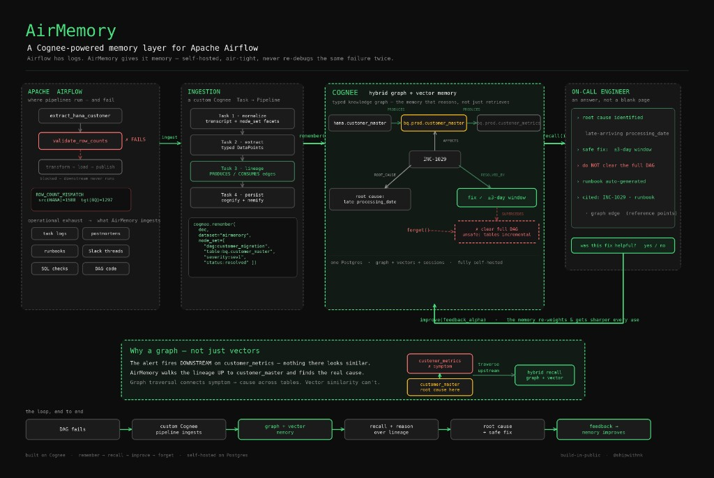
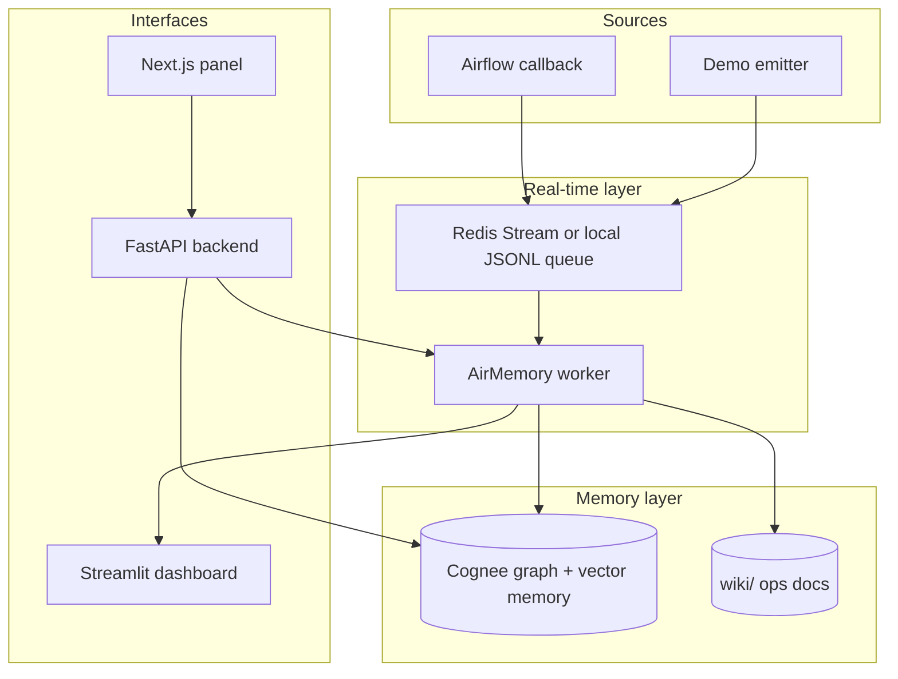
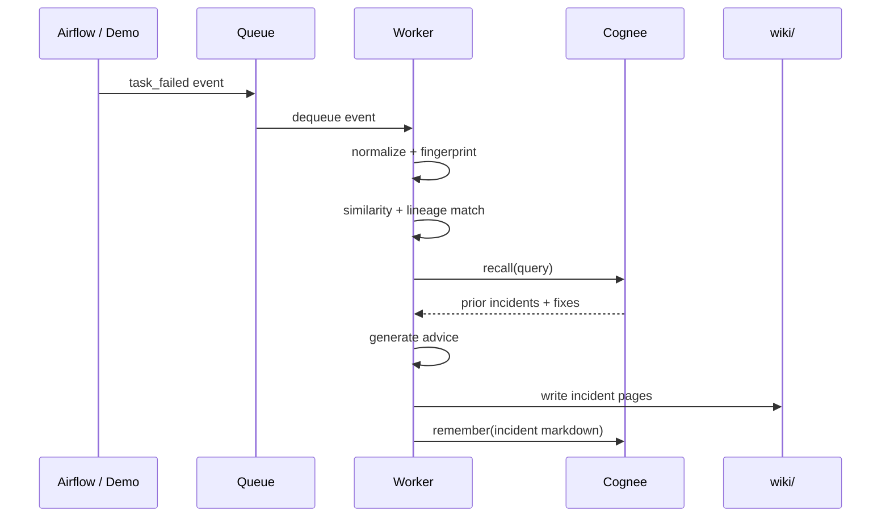
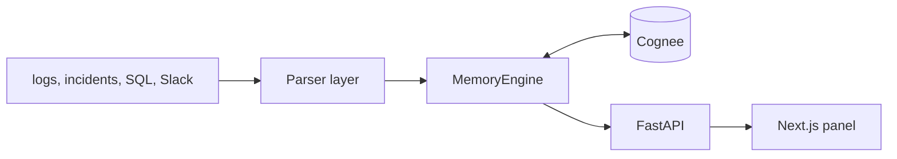
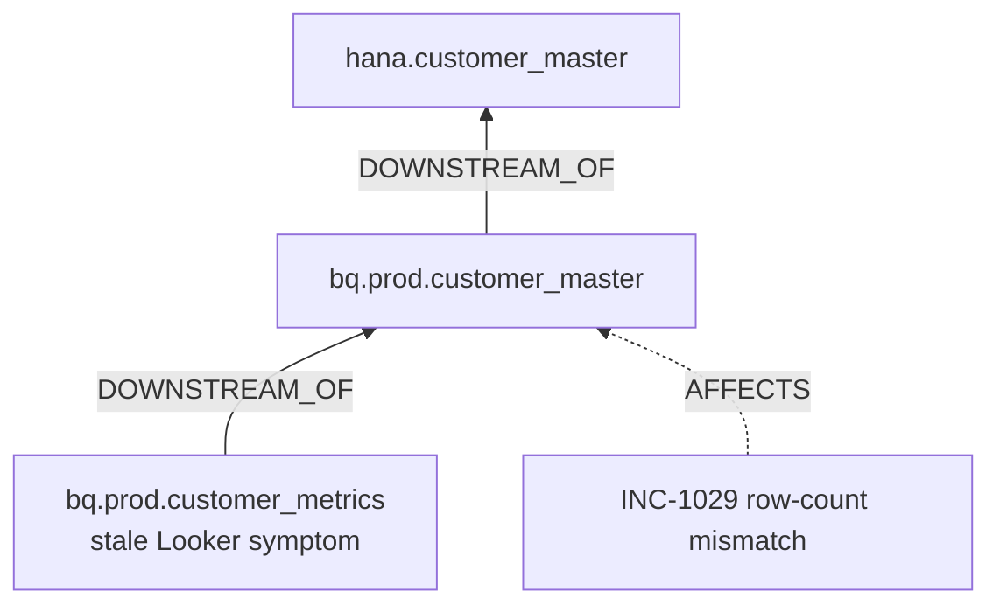
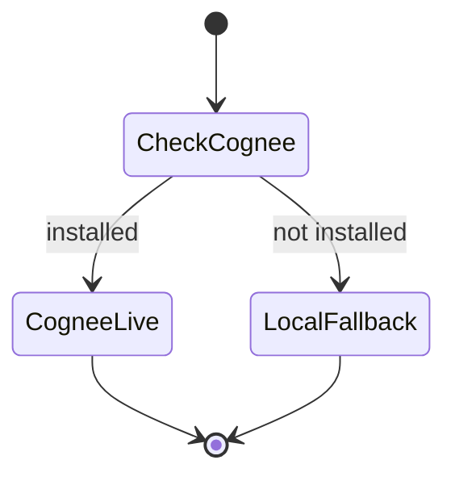

# AirMemory

**Airflow has logs. AirMemory gives it memory.**

When a DAG fails at 3 AM, Airflow tells you what broke. It does not remember why it broke last month, what fix worked, or what your team already tried and rejected. AirMemory stores that context and surfaces it the next time something similar happens.

It uses [Cognee](https://docs.cognee.ai/) for long-term memory: graph + vector search over past incidents, runbooks, and fixes. It also writes a plain markdown wiki your team can read without opening the app.

## What you get

1. **Capture** failures from Airflow callbacks or a demo emitter
2. **Normalize** errors into categories and fingerprints (`missing_partition`, `row_count_mismatch`, etc.)
3. **Match** against past incidents using rules and lineage, not just embeddings
4. **Recall** from Cognee: root causes, accepted fixes, rejected fixes
5. **Advise** on what to do next
6. **Remember** the new incident back into memory and update `wiki/`
7. **Learn** when engineers confirm or reject fixes (improve / forget)

## How it fits together

When `validate_row_counts` fails with `ROW_COUNT_MISMATCH`, AirMemory does not stop at the log line. The worker normalizes the failure, walks upstream lineage, ingests artifacts into Cognee (graph + vector memory), recalls prior incidents like INC-1029, and returns a ranked fix with citations — while `forget()` keeps rejected workarounds out of the answer. The on-call engineer gets a safe recommendation, a runbook, and a feedback loop via `improve()`.



*Figure: from DAG failure through cognify/memify ingestion to hybrid recall. The graph lets AirMemory traverse upstream (`DOWNSTREAM_OF`) when the symptom table has no direct match — not just vector similarity on the downstream error.*

The component view below shows the same system split into queue, worker, memory, and UI layers:



There are two entry points:

| Path | Use it when you want to... | Start with |
|------|---------------------------|------------|
| Runtime pipeline | Process real failure events | `make demo` |
| Instrument panel | Click through recall, lineage, improve, forget | `make api` and `make web` |

Both use the same worker and Cognee dataset.

## Runtime pipeline

This runs when a task fails in Airflow (or when you emit a demo event).



The worker code in `airmemory/processing/incident_pipeline.py` does roughly this:

```python
incident = normalize_event(event, dag_metadata)
deterministic = find_similar_incidents(incident, historical_incidents, top_k=3)
lineage_matches = find_lineage_incident_matches(incident, historical_incidents, top_k=3)
similar = merge_similarity_matches(deterministic, lineage_matches, top_k=3)

recall_query = build_recall_query(incident)
cognee_recall_text = await recall_similar_incidents(
    query=recall_query,
    dataset_name=settings.cognee_dataset,
)

advice = await generate_incident_advice(incident, similar, cognee_recall_text, ...)
await remember_incident_markdown(incident_markdown, dataset_name=settings.cognee_dataset)
```

## Instrument panel

FastAPI backend + Next.js frontend for poking at memory: recall questions, lineage graphs, runbooks, improve/forget, eval scores.



```bash
make api    # http://127.0.0.1:8000
make web    # http://127.0.0.1:3000
```

The **Runtime** tab talks to the live worker queue (`/runtime/*`). You can emit a demo failure and process it from the browser.

## Lineage vs vector search

Embeddings miss a common case: the failure shows up downstream, but the root cause is upstream.

Looker metrics go stale on `publish_metrics`. There is no prior incident on that table. But walking upstream:



AirMemory follows `DOWNSTREAM_OF` edges until it hits INC-1029. Pure vector recall on the downstream symptom often comes up empty.

## Quickstart

No Redis, Airflow, Cognee, or API key needed for the default demo.

```bash
cp .env.example .env
pip install -r requirements.txt
./scripts/run_demo.sh
```

That seeds 8 historical incidents, emits a missing-partition failure on `customer_daily_revenue_dag`, processes it, and prints the recommendation.

Step by step:

```bash
python scripts/seed_memory.py
python scripts/emit_demo_failure.py
python scripts/run_worker.py --once
streamlit run airmemory/dashboard/app.py
```

With Redis:

```bash
docker compose up -d redis
AIRMEMORY_USE_LOCAL_QUEUE=0 python scripts/emit_demo_failure.py
AIRMEMORY_USE_LOCAL_QUEUE=0 python scripts/run_worker.py --once
```

## Cognee

Cognee holds the long-term memory. AirMemory wraps `remember`, `recall`, `improve`, and `forget`. If Cognee is not installed, it falls back to markdown files under `.airmemory_state/cognee_memory/`.



Turn it on:

```bash
pip install cognee>=1.2.2

# .env
AIRMEMORY_USE_REAL_COGNEE=1
COGNEE_DATASET=airmemory_demo
```

Postgres + pgvector (optional):

```bash
docker compose up -d postgres
```

Then set `DB_PROVIDER=postgres`, `VECTOR_DB_PROVIDER=pgvector`, `GRAPH_DATABASE_PROVIDER=postgres` in `.env`. Full list in `.env.example`.

### Remember

Store an incident after the worker processes it (`airmemory/cognee_layer/remember.py`):

```python
import cognee

await cognee.remember(
    markdown,
    dataset_name="airmemory_demo",
    node_set=["airflow_incidents"],
)

# older Cognee versions
await cognee.add(markdown, dataset_name="airmemory_demo", node_set=["airflow_incidents"])
await cognee.cognify(datasets=["airmemory_demo"])
```

### Recall

Search memory when a new failure comes in (`airmemory/cognee_layer/recall.py`):

```python
import cognee

query = """Have we seen Airflow failures similar to this?
DAG: customer_daily_revenue_dag
Task: transform_revenue
Failure category: missing_partition
Error: partition 2026-07-01 not found in raw.customer_transactions
"""

result = await cognee.recall(query, datasets=["airmemory_demo"])
```

The worker builds this query with `build_recall_query(incident)`.

### Improve

An engineer confirms a fix. Record it and bump that resolution up the rankings (`app/memory.py`):

```python
import cognee

session_id = "incident_INC-1029"

await cognee.remember(
    "# Feedback for INC-1029\nAccepted resolution: res-window-3-day\n"
    "Feedback: Confirmed the 3-day processing_date window resolved the incident.",
    dataset_name="airmemory",
    session_id=session_id,
    node_set=["source:feedback", "dag:customer_daily_migration_dag"],
)

await cognee.improve(
    dataset="airmemory",
    session_ids=[session_id],
    feedback_alpha=0.7,
)
```

In the web panel: **Improve** tab, confirm the fix, watch the accepted resolution move from rank 2 to rank 1.

### Forget

Stop surfacing a bad workaround (`app/memory.py`):

```python
import cognee

await cognee.forget(dataset="airmemory_deprecated_full_dag_clear")
```

In the web panel: **Forget** tab removes the "clear full DAG" workaround. Leakage check should hit 0.

### Graph model

When seeding artifacts, AirMemory passes a domain schema so Cognee knows about pipelines, tasks, tables, and incidents:

```python
graph_model = {
    "entities": [
        "Pipeline", "Task", "Table", "Incident",
        "RootCause", "Resolution", "Engineer",
    ],
    "relationships": [
        "HAS_TASK", "PRODUCES", "CONSUMES", "AFFECTS",
        "HAS_ROOT_CAUSE", "RESOLVED_BY", "AUTHORED_BY",
        "SUPERSEDES", "EXPERT_IN", "DOWNSTREAM_OF",
    ],
}

await cognee.remember(artifact_text, dataset_name="airmemory", graph_model=graph_model)
```

Facets for filtered recall:

```python
node_set = [
    "source:incident",
    "dag:customer_daily_migration_dag",
    "task:validate_row_counts",
    "status:resolved",
]
```

### Full lifecycle example

```python
import asyncio
import cognee

async def main():
    dataset = "airmemory_demo"

    await cognee.remember(
        "# INC-1029\nRoot cause: exact processing_date validation missed late HANA records.\n"
        "Fix: use system_date - 3 through system_date + 3 window.",
        dataset_name=dataset,
        node_set=["source:incident", "dag:customer_daily_migration_dag"],
    )

    answer = await cognee.recall(
        "validate_row_counts failed with ROW_COUNT_MISMATCH on customer_master",
        datasets=[dataset],
    )
    print(answer)

    session = "incident_INC-1029"
    await cognee.remember(
        "Engineer confirmed: 3-day window fix worked.",
        dataset_name=dataset,
        session_id=session,
    )
    await cognee.improve(dataset=dataset, session_ids=[session], feedback_alpha=0.7)

    await cognee.forget(dataset="airmemory_deprecated_full_dag_clear")

asyncio.run(main())
```

## API

**Memory (instrument panel)**

| Endpoint | What it does |
|----------|--------------|
| `GET /health` | Status, Cognee on/off |
| `POST /seed` | Load sample artifacts |
| `POST /recall` | Ask a question, get citations + ranked fixes |
| `POST /improve` | Submit engineer feedback |
| `POST /forget` | Drop a deprecated workaround |
| `POST /runbook` | Generate a runbook |
| `GET /graph` | Lineage graph for downstream symptoms |
| `POST /eval` | Run the recall quality harness |

**Runtime (live worker)**

| Endpoint | What it does |
|----------|--------------|
| `GET /runtime/summary` | Queue mode, latest incident |
| `GET /runtime/incidents` | List processed IDs |
| `GET /runtime/incidents/{id}` | Full result for one incident |
| `POST /runtime/emit` | Push a demo failure to the queue |
| `POST /runtime/process` | Process one queued event |

```bash
curl -X POST http://127.0.0.1:8000/runtime/emit
curl -X POST http://127.0.0.1:8000/runtime/process
curl http://127.0.0.1:8000/runtime/incidents
```

## Config

| Variable | Default | Notes |
|----------|---------|-------|
| `AIRMEMORY_USE_LOCAL_QUEUE` | `1` | Set `0` for Redis |
| `AIRMEMORY_USE_FAKE_LLM` | `true` | Set `false` and add `LLM_API_KEY` for real advice |
| `AIRMEMORY_USE_REAL_COGNEE` | `0` | Set `1` to use live Cognee |
| `COGNEE_DATASET` | `airmemory_demo` | Dataset name |
| `AIRMEMORY_WIKI_DIR` | `./wiki` | Where wiki pages land |
| `REDIS_URL` | `redis://localhost:6379/0` | Redis connection |

Copy `.env.example` to `.env` and edit from there.

## Repo layout

```text
airmemory/     worker, Cognee wrappers, wiki writer, Streamlit dashboard
app/           FastAPI, MemoryEngine, parsers, lineage, runtime bridge
web/           Next.js panel
seed_data/     historical incidents, DAG metadata, lineage
wiki/          generated ops docs
scripts/       seed, emit, worker, demo
tests/         pytest (22 tests)
```

## Commands

```bash
make demo         # full CLI demo
make api          # FastAPI on :8000
make web          # Next.js on :3000
make seed-memory  # load historical incidents
make emit         # emit demo failure
make worker       # process one event
make dashboard    # Streamlit UI
make test         # pytest
```

## Tests

```bash
pytest
./scripts/run_demo.sh
cd web && npm run lint && npm run build
```

CI runs on push via `.github/workflows/ci.yml`.

## Safety

AirMemory suggests fixes. It does not rerun your DAGs.

- Review destructive reruns before running them
- Check source data is ready before retrying tasks
- Log rejected fixes so nobody tries them again
- Use **Forget** to pull deprecated workarounds out of recall

## More docs

- [ARCHITECTURE.md](ARCHITECTURE.md) for system design detail
- [DEMO_SCRIPT.md](DEMO_SCRIPT.md) for a presentation walkthrough
- [Cognee docs](https://docs.cognee.ai/) for the underlying memory APIs
